# 演習の環境構築

演習を始める前に環境を構築します。

> 集合形式の演習などの場合には以下の手順は不要かもしれません。講師やスタッフの指示に従ってください。

---

## 1. Grove Beginner Kit for Arduino の用意

この演習では **Grove Beginner Kit for Arduino** を使用します。

[**こちらのサイト**](https://www.switch-science.com/catalog/6361/) などいくつかの通信販売サイトで購入してください。

---

## 2. Arduino IDE のインストール

Arduino や互換ボードの開発環境 Arduino IDE をダウンロード、インストールします。

[**ダウンロードページ**](https://www.arduino.cc/en/software) からインストーラーをダウンロードして PC にインストールします。

ダウンロードの途中で、Arduino IDE への寄付を求められるかもしれません。

寄付する場合は任意の金額を選択して [Contribute & Download] をクリックします。  
寄付せずにダウンロードして利用することもできます。その場合は [**Just Download**] をクリックします。

> 寄付の有無によって Arduino IDE の機能に差はありません。  
> Arduino IDE 開発継続のためのサポートなので、数ドル程度の余裕のある方は寄付するといいでしょう。

Arduino IDE のインストールの途中でドライバーのインストールを求められた場合は、[インストール] を選択して進めます。

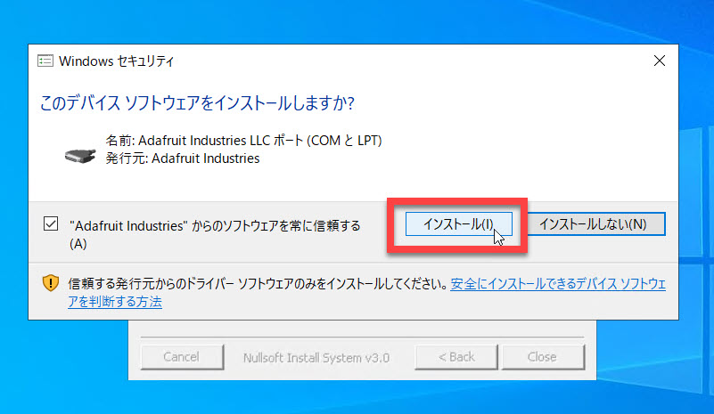

---

## 3. USB ドライバーのインストール

Grove Beginner Kit を PC に接続して開発するにはボードに対応した USB ドライバーが必要です。

CP2101 USB Driver は [Silicon Lab](https://www.silabs.com/developers/usb-to-uart-bridge-vcp-drivers) のサイトからダウンロードできます。

[**DOWNLOADS**] タブをクリックしてから使用している OS にあわせた USB ドライバーをダウンロードして PC にインストールします。

> Windows では "CP210x Universal Windows Driver" を選択してください。

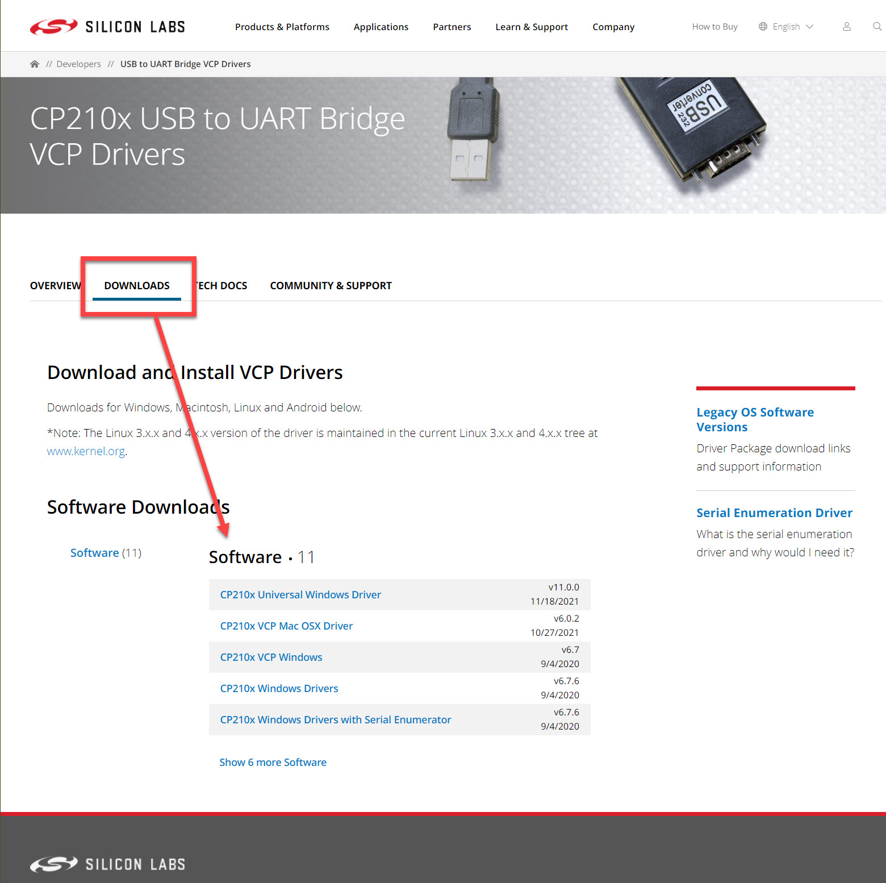

ダウンロードファイルは ZIP 形式です。ダウンロード後に任意のフォルダーに展開（解凍）します。

Windows の場合は、展開後の "**silabser.inf**" を右クリックして [**インストール**] を選択します。  
インストールを開始すると [セキュリティの警告] が表示されます。"開く" をクリックしてインストールを進めます。

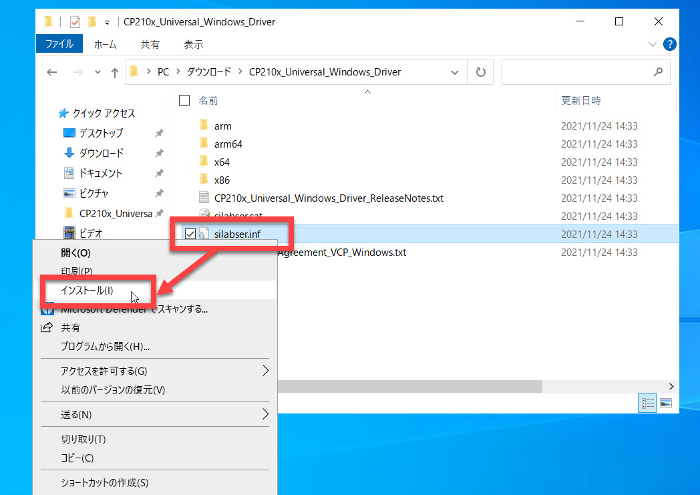
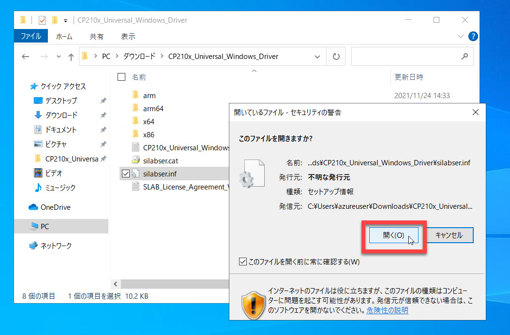

ここで一旦 OS を再起動します。

---

## 4. コンテンツのダウンロード

コンテンツを PC にダウンロードします。

[**GitHub のこちらのページ**](https://github.com/seosoft/IoTKitTraining) で [Code] - [Download ZIP] を選択します。

ZIP ファイルがダウンロードされるので任意のフォルダーに展開（解凍）します。

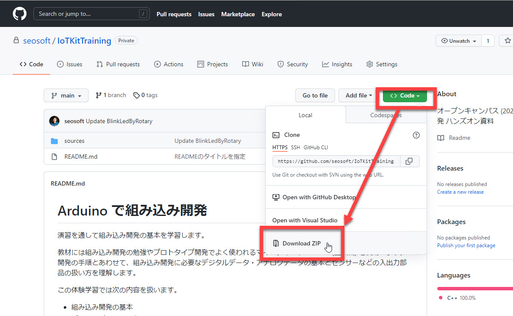

---

## 5. Arduino IDE の起動

Arduino IDE を起動します。

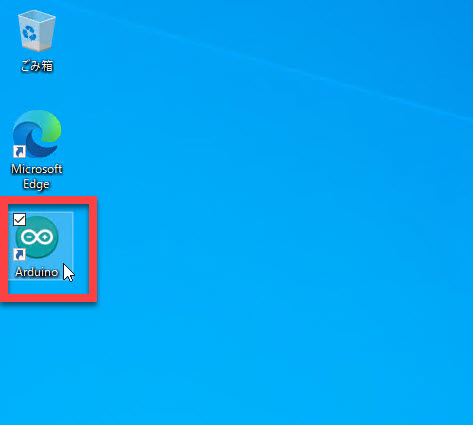

[ツール] - [ボード] で "Arduino Uno" を選択します。

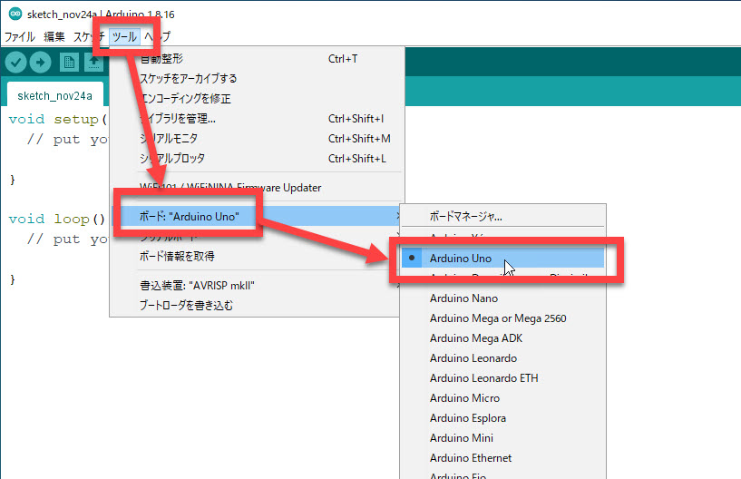

[ツール] - [シリアルポート] でマイコンボードが接続されたポートを選択します。

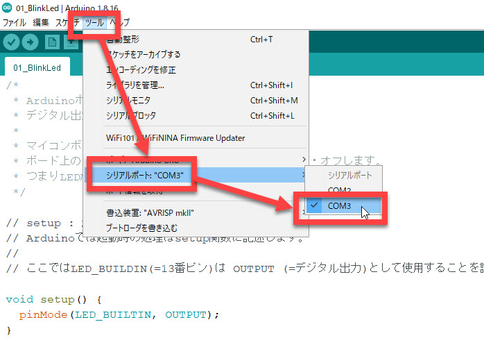

> ポート番号は、使っている PC によって異なります。  
> すでに他の周辺機器を接続している場合は複数のポートが表示されるかもしれません。  
> PC の知識があれば、デバイスマネージャーで CP210x が接続されたポートを確認してください。
> 
> 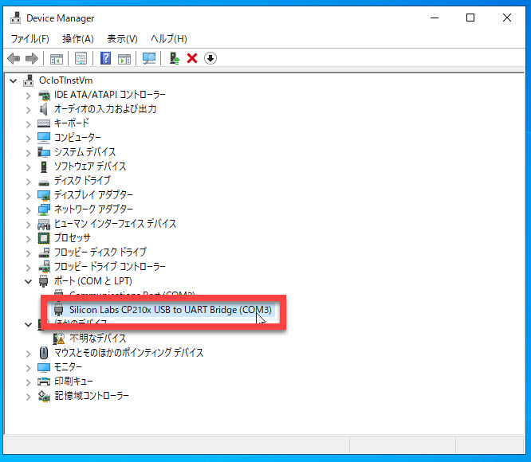

[ツール] - [シリアルポート] - [ポートの設定] を選択します。
> 
> PC のデバイスについてよくわからない場合は、ポートを順番に選択して演習を実施してみることもできます。適切なポートが選択できるとプログラムをボードに転送して実行させることができます。

---

## 6. ライブラリのインストール

演習で使用するいくつかのデバイスは、追加でライブラリのインストールが必要です。

今回の演習では以下のライブラリが必要です。

|名前|目的|備考|
|---|---|---|
|Grove Temperature and Humidity Sensor|温度、湿度センサーを利用するために必要|似た名前のライブラリが複数見つかりますが、必ず左の名前の通りのライブラリをインストールします|
|U8g2|液晶ディスプレイを利用するために必要||
|Grove - LCD RGB Backlight|[外付けのキャラクターディスプレイ](https://www.switch-science.com/catalog/1629/) を利用するために必要|Grove Beginner Kit には載っていない外付けのディスプレイが必要なので、持っていない場合はインストール不要|

ライブラリをインストールするには、Arduino IDE の [スケッチ] - [ライブラリをインクルード] - [ライブラリを管理] を選択します。

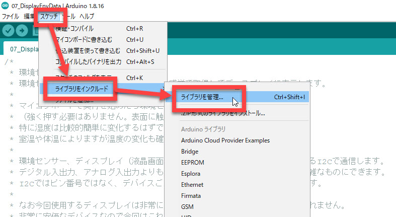

ライブラリマネージャーが開いたら、上記のライブラリの名前を順に検索ボックスに入れて、適切なライブラリを [インストール] でインストールします。

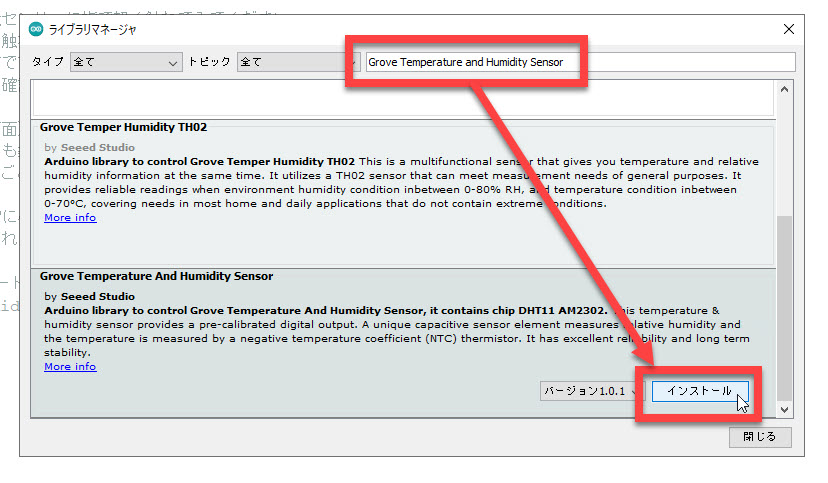

---

環境構築は以上で終わりです。

早速演習を始めましょう。