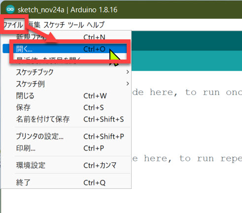
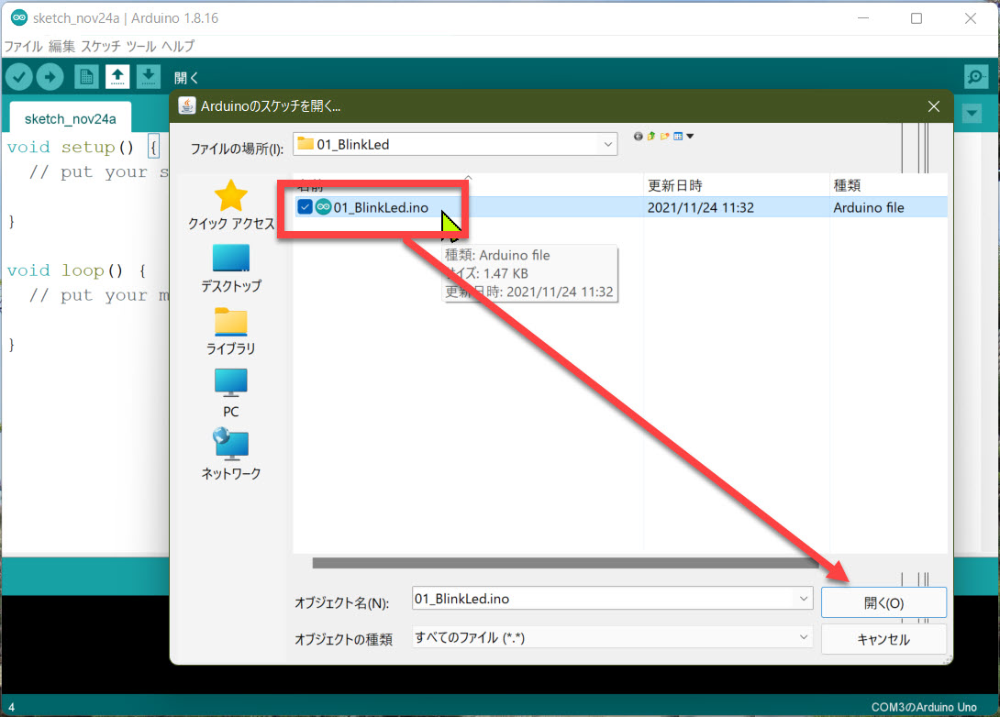
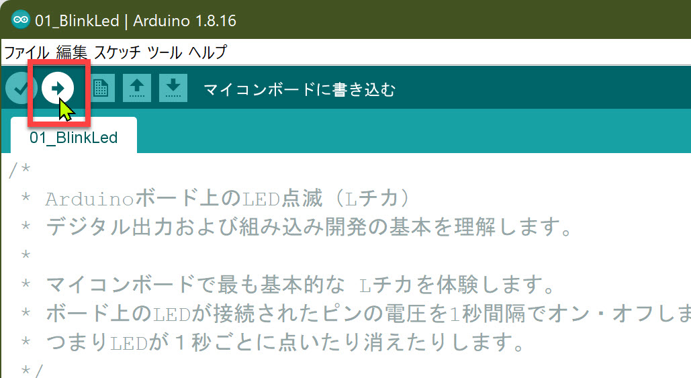

# Arduino IDE の操作

演習を進める上で必要となる、Arduino IDE の操作を覚えます。

---

## 1. Arduino IDE の起動

Grove Beginner Kit を PC に接続して Arduino IDE を起動します。

はじめて Arduino IDE を起動した場合は、空のスケッチが開きます。  
以前、別のスケッチを編集していた場合は、そのスケッチが開くはずです。

> Arduino ではプログラムのソースコードのことを **スケッチ** と呼びます。

---

## 2. スケッチを開く

このコンテンツには動作確認済みの複数のスケッチがあらかじめ用意されています。

演習で使うスケッチを開くには二通りの操作方法があります。

- メニューの [ファイル]-[開く] を選択
- ツールバーの [開く] を選択

ダイアログ（ファイル選択ウィンドウ）が開いたら、ここでは "**01_BlinkLed.ino**" を選択して開いてみます。

これで演習で使用するスケッチが開きます。

---

## 3. 新規のスケッチ作成と編集したスケッチの保存

新規のスケッチを開いて編集を始めるには、

- [ファイル]-[新規ファイル]
- ツールバーの [新規ファイル]

で操作します。

編集したスケッチを保存するには、

- [ファイル]-[新規ファイル]
- ツールバーの [新規ファイル]

で操作します。

ダイアログが開いたら、スケッチの内容を表す名前を決めて保存します。

---

## 3. スケッチをマイコンボードに書き込む

スケッチをマイコンボードに書き込むと、自動的にボード上で動作が始まります。

スケッチを書き込むには、ツールバーの [マイコンボードに書き込む] を選択します。

PC 上で実行ファイルが作成されてからマイコンボードに書き込まれます。

スケッチに文法的なエラーがある場合には実行ファイルの作成に失敗します。この場合はマイコンボードへの書き込みも行われません。

スケッチに文法的なエラーがないかを確認するには検証します。（プログラミング一般ではコンパイルまたはビルドと言います）

検証するには、ツールバーの [検証] を選択します。

---

この演習の通りに実施していれば、"**01_BlinkLed.ino**" が Grove Beginner Kit に書き込まれて、マイコンボード上の LED が1秒間隔で点滅します。

以上が Arduino IDE の操作方法です。

スケッチの内容や文法には触れていませんが、まず操作方法を覚えておきましょう。