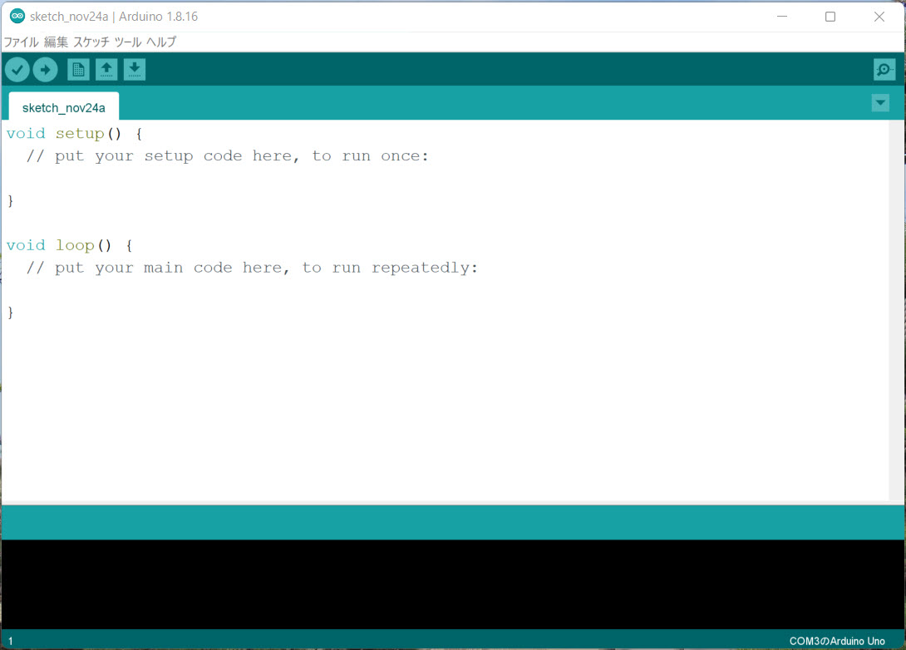
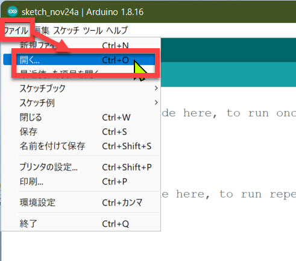
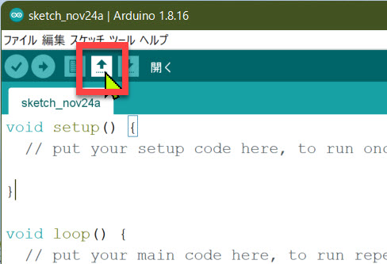
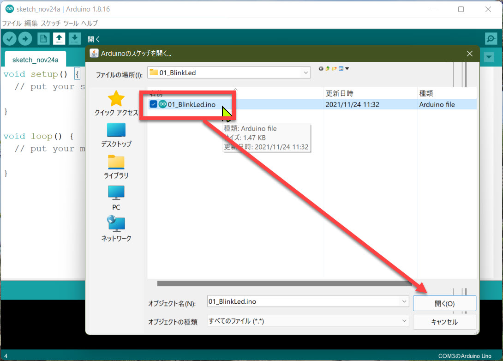
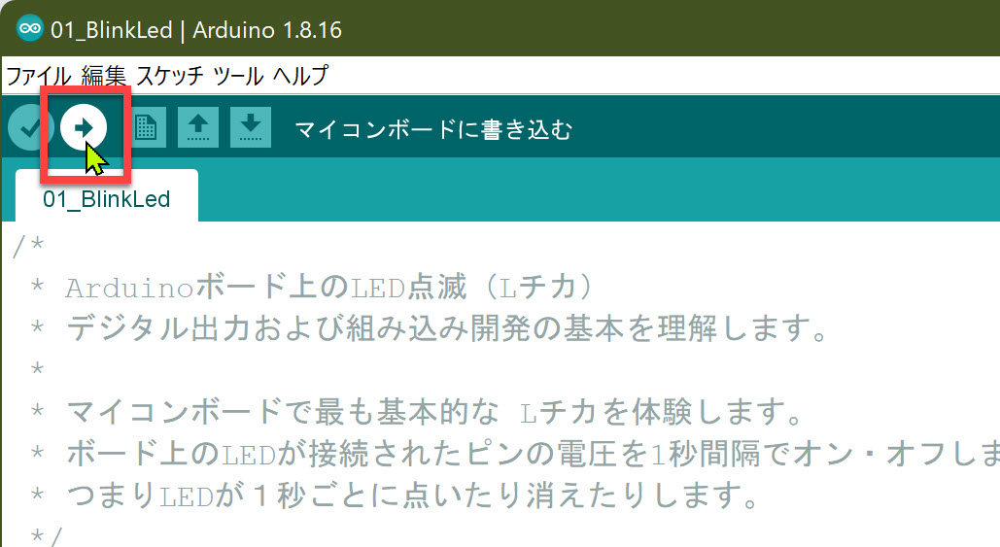
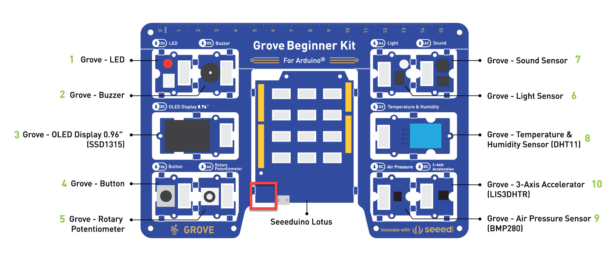

# 組み込み開発の基礎とデジタル出力

最初の演習として、

- Arduino の基本的な操作（組み込み開発の基礎）
- デジタル出力（マイコンボード上の LED 点滅）

を体験します。

---

## 1. Arduino IDE の起動

Grove Beginner Kit を PC に接続して Arduino IDE を起動します。

はじめて Arduino IDE を起動した場合は、空のスケッチが開きます。

> Arduino ではプログラムのソースコードのことを **スケッチ** と呼びます。

---

## 2. 演習のスケッチを読み込む

演習で使うスケッチを読み込みます。  
このコンテンツには動作する複数のスケッチがあらかじめ用意されています。

作成済みのスケッチを開くには二通りの方法があります。

- メニューの [ファイル] - [開く] を選択
- ツールバーの [開く] を選択

ダイアログ（ファイル選択ウィンドウ）が開いたら "**01_BlinkLed.ino**" を選択して開きます。

これで、デジタル出力を体験するためのスケッチが開きます。  
この後の演習でも同じ操作で指定のスケッチを開いていきます。

---

## 3. スケッチをマイコンボードに書き込む

スケッチをマイコンボードに書き込むと、自動的にボード上で動作が始まります。

スケッチを書き込むには、ツールバーの [マイコンボードに書き込む] を選択します。

PC 上で実行ファイルが作成されてからマイコンボードに書き込まれます。

---

## 4. デジタル出力とは

デジタル出力とは、**オンかオフか** のどちらかの値が出力されるものです。  
例えば、LED の点灯、消灯がそれにあたります。

> 回路によっては LED の明るさを変えることもできますが、デジタル出力とは LED が点いている状態と消えている状態とを切り替えることを意味します。

---

## 5. デジタル出力の実行

デジタル出力の例として "**01_BlinkLed.ino**" を実行します。  

上の手順で "01_BlinkLed.ino" スケッチを Arduino IDE で開いて、マイコンボードに書き込みます。

マイコンボード（中央の Seeduino Lotus : Arduino 互換ボード）上の LED が1秒間隔で点滅を繰り返します。  
このような動作を "Lチカ" (= LED チカチカの意味) と言います。

> Arduino / Arduino 互換ボードに限らず、多くのマイコンボードには LED が載っています。  
> これによってマイコンボード自体が壊れていないかや、スケッチの書き込みや実行ができるかを確認できるようになっています。

Arduino のスケッチの基本的な構造は、次のスケッチ（外部の LED 点滅）のところで説明します。  
ここではマイコンボードで Lチカできることを確認することにします。