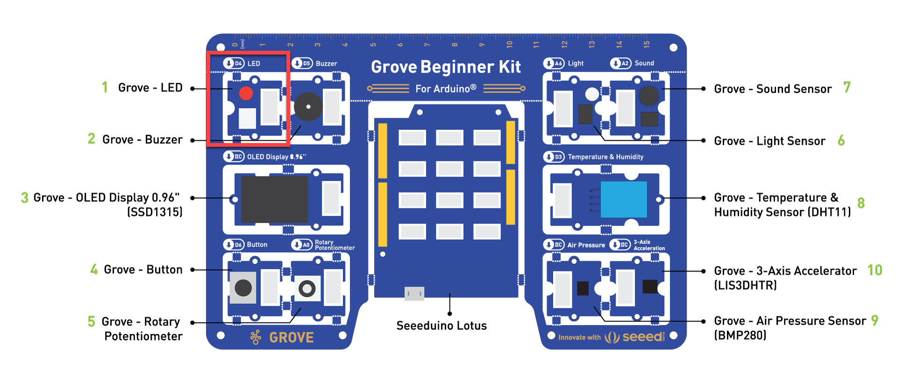

# 外部の LED 点滅

マイコンボード上の LED と同じように外部の LED も点滅させることができます。

デジタル出力するポートを変更するだけで、マイコンボード上の Lチカと全く同じコードで外部の LED も Lチカできることを見てみます。

---

## 1. 外部の LED

Grove Beginner Kit では外部 LED は 4番ポートに接続されています。

> 入出力の端子のことを **ポート** と言います。



マイコンボード上の LED も外部の LED もどちらもデジタル出力なので、接続されたポートが異なるだけで全く同じコードです。

---

## 2. スケッチの実行

外部 LED を点滅させるスケッチとして "**02_BlinkExtLed.ino**" を実行します。  

"02_BlinkExtLed.ino" スケッチを Arduino IDE で開いて、マイコンボードに書き込みます。

Grove Beginner Kit 左上の LED が1秒間隔で点滅を繰り返します。


---

## 3. スケッチの基本的な構造

Arduino のスケッチは基本的に以下の構造です。

```ino
void setup() {
  // put your setup code here, to run once:

}

void loop() {
  // put your main code here, to run repeatedly:

}
```

スケッチには 2個の関数があります。

|関数名|処理内容|
|---|---|
|setup|マイコンボードに電源が共有された後やボードがリセットされた後に **一度だけ** 実行されます。<br />ボード自体や接続されたデバイスの初期化を行います|
|loop|ボードの電源を切るまで繰り返し実行されます。<br />t例えば、定期的にセンサーから値を取得して、それに応じて何かのデータを出力ポートに出力するなどの処理を繰り返します。|

> 関数とは、処理の固まりをまとめたものだと考えてください。

Lチカの場合は、

|関数名|処理内容|
|---|---|
|setup|外部 LED が4番ポートに接続されていること、およびデジタル出力のポートであることを指定します|
|loop|1秒ごとに 4番ポートの出力をオン、オフと切り替えます。<br />これによって LED が点灯したり消灯したりします。|